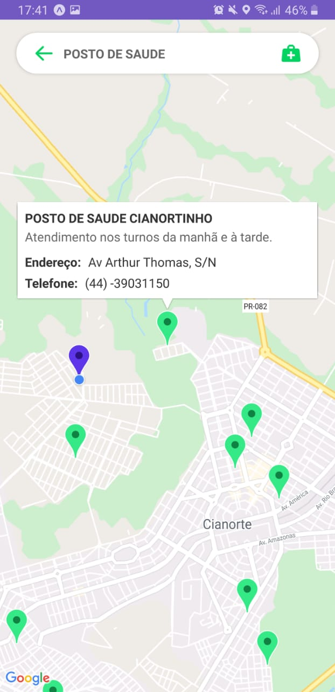

<h1 align="center">
    Healthmap
</h1>

# Index

- [About](#about)
- [Technologies Used](#technologies-used)
- [How to use](#how-to-use)
- [How to Contribute](#how-contribute)

## :bookmark: About 

The idea was presented by the faculty and I decided to implement it my way with different file structure and technologies.

This application aims to show users health agencies close to their geolocation. In the application it is possible to search for Hospitals, Health Centers and FIND. Also, it is possible to use the GPS to reach the chosen location.

## :heavy_check_mark: Result 

<h4 align="center">
    
</h4>

## :rocket: Technologies Used

The project was developed using the following technologies

- [React Native](https://reactnative.dev/)
    - [React Native Maps](https://github.com/react-native-community/react-native-maps)
    - [React Native Communications](react-native-communications)
- [React Navigation v5](https://reactnavigation.org/)
- [Styled Components](https://styled-components.com/)
- [Axios](https://github.com/axios/axios)
- [Expo](https://expo.io/)
    - [Expo Location](https://docs.expo.io/versions/latest/sdk/location/)

## :iphone: Screens

<h4 align="center">
    
    
    
</h4>

## :fire: How to use

- Clone esse repositório: `git clone https://github.com/dark-knight37/healthmap.git`
- Instale as dependências: `npm install` 
- Start a aplicação: `npm start`

## :recycle: how to contribute

- Fork this repository,
- Create a branch with your feature: `git checkout -b my-feature`
- commit your changes: `git commit -m 'feat: My new feature'`
- Push your branch: `git push origin my-feature`